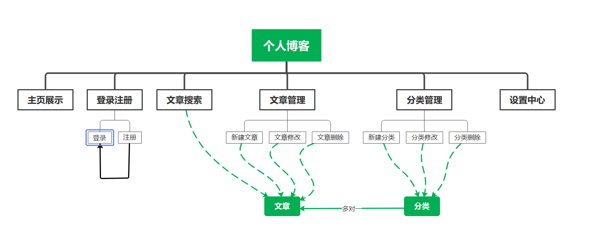

# 个人博客


Person Blog是一款简易个人博客网站。专为个人用户打造的个性化、社交化的个人博客系统。该网站可以供用户个人编写文章，根据个人需求，展示自我、展示个性、展示文采，向广大的互联网展示独特的自我。


**功能框架结构图**


# 问题表述


1. **用户画象**:热衷于展示个性18-28的年轻人
2. **用户需求**:独特的展示自我的平台
3. **用户使用场景**:在学习、生活中，有所思考、有所心得，希望能分享、传播给所有人，就可以在该系统上随时随地的发表自己的文章，分享给大家。
4. **用户任务**:向广大互联网分享自己的想法
5. **用户痛点**:个性表达是每个人的天性，尤其是青少年，青春的活跃促使他们有着比常人更旺盛的表达欲望。但是表达途径的缺乏和单一阻碍了他们
6. **产品益点**:有助于人们表达自我

# 解决方案表述


本项目主要通过主页展示、登录注册、文章搜索、分类管理、文章管理、设置中心等6个功能，搭配 Bootstrap 的统一样式模版及 HTML 、CSS 相关知识来完成，如下为整个功能的完成部分。


# 编程功能的基本描述


本项目主要功能有
1. 主页展示 
2. 登录注册
3. 文章搜索
4. 分类管理
5. 文章管理
6. 设置中心


具体涉及的知识点如下:


1. [Flask 第三方模块](https://read.helloflask.com/)的使用

```python
from flask import Flask, request, render_template

def create_app():
    app = Flask('personal_blog')
    config_app(app)
    register_extension(app)
    register_blueprint(app)
    register_faker_value(app)
    register_shell_context(app)
    register_template_context(app)
    register_logger(app)
    return app


```

2.  [Sqlite 数据库](https://www.osgeo.cn/sqlalchemy/)，储存用户、文章数据

```python
class Admin(db.Model, UserMixin):
    id = db.Column(db.Integer, primary_key=True)
    username = db.Column(db.String(20))
    password_hash = db.Column(db.String(128))

    def set_password(self, password):
        self.password_hash = generate_password_hash(password)

    def check_password(self, password):
        return check_password_hash(self.password_hash, password)

```

3. [Bootstrap](https://www.bootcss.com/)，前端页面美化

```html
    <link href="{{ url_for('static', filename = 'css/bootstrap.min.css') }}" rel="stylesheet" />
    <link rel="stylesheet" href="https://cdn.bootcss.com/normalize/8.0.1/normalize.min.css">
```


4. [ckeditor](https://ckeditor.com/)，富文本编辑API

```python
from flask_ckeditor import CKEditorField

class PostForm(FlaskForm):
    title = StringField('标题', validators=[DataRequired(), Length(1, 60)], render_kw={'class':'form-title'})
    category = SelectField('分类', coerce=int, default=1)
    body = CKEditorField('文章主体', validators=[DataRequired()])
    submit = SubmitField('发布')

    def __init__(self, *args, **kwargs):
        super(PostForm, self).__init__(*args, **kwargs)
        self.category.choices = [(category.id, category.name)
                                 for category in Category.query.order_by(Category.name).all()]


```


5. [HTML 表单](https://www.runoob.com/html/html-forms.html)，让用户输入账号、文章信息等数据

```python

    <div class="container h-100">
        <div class="row h-100 page-header justify-content-center align-items-center">
            <h1>登录</h1>
        </div>
        <div class="row h-100 justify-content-center align-items-center">
            <form method="post">
            {{ form.csrf_token }}

            {{ render_form(form) }}
            </form>
        </div>
    </div>

```

5. [HTTP 请求](https://www.runoob.com/http/http-methods.html)，用于数据的传递

```python
@admin_bp.route('/login', methods=['GET', 'POST'])
def login():
    if current_user.is_authenticated:
        flash(u'你已经登录了！', 'info')
        return redirect(url_for('blog.index'))

    form = LoginForm()
    if form.validate_on_submit():
        username = form.username.data
        password = form.password.data
        remember = form.remember.data
        admin = Admin.query.first()
        if admin:
            if admin.check_password(password):
                login_user(admin, remember)
                flash('登录成功', 'info')
                return redirect_back()

            flash('账号密码错误', 'warning')
        else:
            flash('No account.', 'warning')
    return render_template('admin/login.html', form=form)

```

6. [Python基础](https://www.liaoxuefeng.com/wiki/1016959663602400)

```python

admin = Admin.query.first()
        new_password = form.password.data
        admin.username = form.username.data
        admin.set_password(new_password)
        db.session.add(admin)
        db.session.commit()
      
```


| 知识点         | Flask 第三方模块的使用  | 数据库 | Bootstrap|ckeditor| HTML表单 | HTTP 请求 | Python基础 |
| -------------- | ---------------------- | ------ | ---------| --------- | -------- | --------- | ---------- |
| 学习成本（天） | 2                      | 1.5    | 1.5      |1.5 | 1        | 1         | 1.5        |
| 应用比例       | 20%                    | 15%    | 15%      |15% | 10%      | 10%       | 15%        |


# 云端项目部署的基本描述（总200-250字，


##  3.1 页面链接与页面功能介绍


1. 主页展示: http://traiyipaw.pythonanywhere.com/
2. 登录注册: http://traiyipaw.pythonanywhere.com/login
    1. 登录: http://traiyipaw.pythonanywhere.com/login
    2. 注册: http://traiyipaw.pythonanywhere.com/register
3. 文章搜索: http://traiyipaw.pythonanywhere.com/search
4. 分类管理: http://traiyipaw.pythonanywhere.com/category/manage
    1. 新建分类: http://traiyipaw.pythonanywhere.com/category/new
    2. 分类修改: http://traiyipaw.pythonanywhere.com/category/1/edit
    3. 分类删除: http://traiyipaw.pythonanywhere.com/category/manage
5. 文章管理: http://traiyipaw.pythonanywhere.com/manage_post
    1. 新建文章: http://traiyipaw.pythonanywhere.com/new_post
    2. 文章修改: http://traiyipaw.pythonanywhere.com/post/1/edit
    3. 文章删除: http://traiyipaw.pythonanywhere.com/manage_post
6. 设置中心: http://traiyipaw.pythonanywhere.com/setting

有效功能页面数量共14个

## 3.2 数据流程图



## 3.3 功能

1. 主页展示 
2. 登录注册
3. 文章搜索
4. 分类管理
5. 文章管理
6. 设置中心

## 3.4 心得

能够本地运行良好的项目并不意味着在部署后依然能够良好运行。部署中我遇到如下问题:


1. 网站无法显示（WSGI未配置好）
2. 代码不能同步更新（未建立git远程和本地的连接）
3. 项目更新后无法启动（路经配置错误）


遇到这些问题，我们通过如下手段解决问题
1. 查看[文档](https://help.pythonanywhere.com/pages/)解决
2. 通过邮件[寻求技术人员](https://www.pythonanywhere.com/forums/)的帮助。
3. [百度](https://www.baidu.com/)是最好的老师


# 学习/实践心得总结及感谢

在完成项目的过程中，我收益良多，学习到了很多以前没有接触过的知识，能最终得以顺利完成，是得到很多来自网络上的老师、前辈、同行等人提供的教程、博客的帮助，在此特别感谢[Grey Li](https://github.com/greyli)老师的[Flask 入门教程](http://helloflask.com/tutorial/)、[廖雪峰老师](https://www.liaoxuefeng.com/)的[Python教程](https://www.liaoxuefeng.com/wiki/1016959663602400)、以及[菜鸟教程](https://www.runoob.com/)、[Bootstrap中文网](https://www.bootcss.com/)。

编程思维带给我们的不仅是代码、程序、数据库、网站这些具体的东西，更多是锻炼了我们解决问题、逻辑思维的能力，我从中学会了如何将大项目分解成小任务、将小代码如何组合成大项目，同时项目开发中遇到的种种困难也锻炼了我的耐心与恒心，让我更有勇气面对一切挑战。


# 参考

[person_blog](https://github.com/zzsealy/personal_blog)
